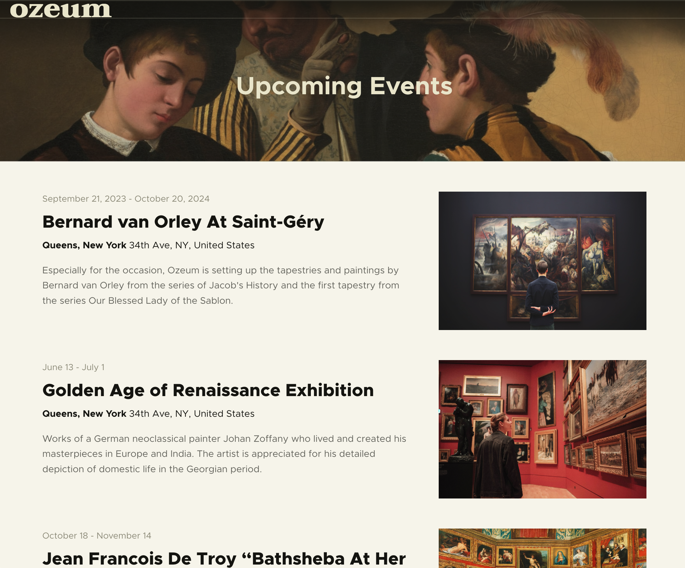
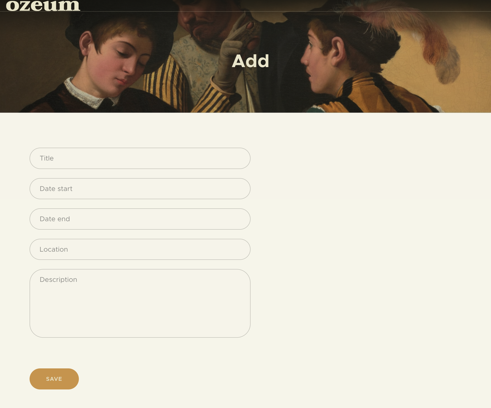

Имате задача да креирате систем за управување со уметничка галерија. Системот ќе управува со три главни субјекти: уметнички дела, уметници и изложби. Вашата цел е да изградите веб-апликација која овозможува управување со овие ентитети преку интуитивен интерфејс. Апликацијата ќе вклучува почетна страница и страница за додавање изложби. Исто така потребно е и одредено прилагодување во административниот панел на Django. Дополнително, системот ќе инкорпорира односи каде секоја изложба може да содржи повеќе уметнички дела, еден автор може да има повеќе уметнички дела, едно дело може да биде прикажано само на една изложба и едно дело може да биде само на еден автор.

Притоа, во рамки на aдмин панелот потребно е да ги обезбедите следните функционалности:

- Изложби и автори може да бидат додадени само од супер-корисници
- Уметнички дела можат да бидат додадени само од уметници и уметникот по автоматизам се додава како автор на делото
- Уметниците може да ги прегледаат само изложбите на кои имаат свое дело
- Делата можат да бидат менувани само од нивите уметници
- Супер-корисниците може да ги гледаат само изложбите што следат, не и тие што се завршени 

Web апликацијата се состои од една почетна страна, прикажана на сликата подолу која ги прикажува сите изложби заедно со нивните информации и една слика од таа изложба.

Исто така постои и страна за додавање на нови изложби. Изгледот на страната е даден во продолжение.

За субјектите се чуваат следниве инфромации

- Уметничко дело: наслов, датум на создавање, слика.
- Уметник: име (и презиме), уметнички стил (impressionism, pop art, graffiti).
- Изложба: наслов, датум на почеток, датум на завршување, опис, локација.

index.html

add.html

Другите слики се достапни во media -> images