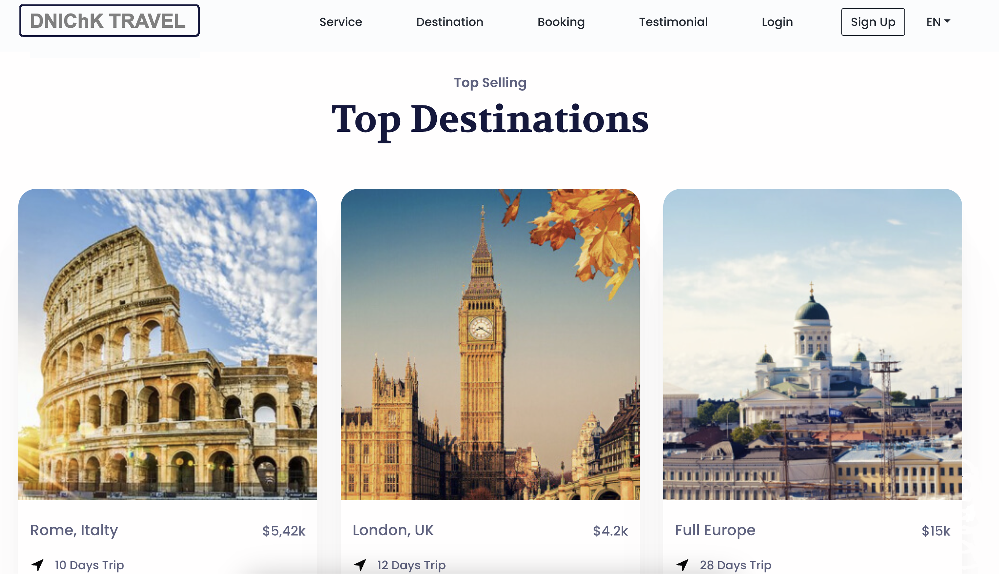
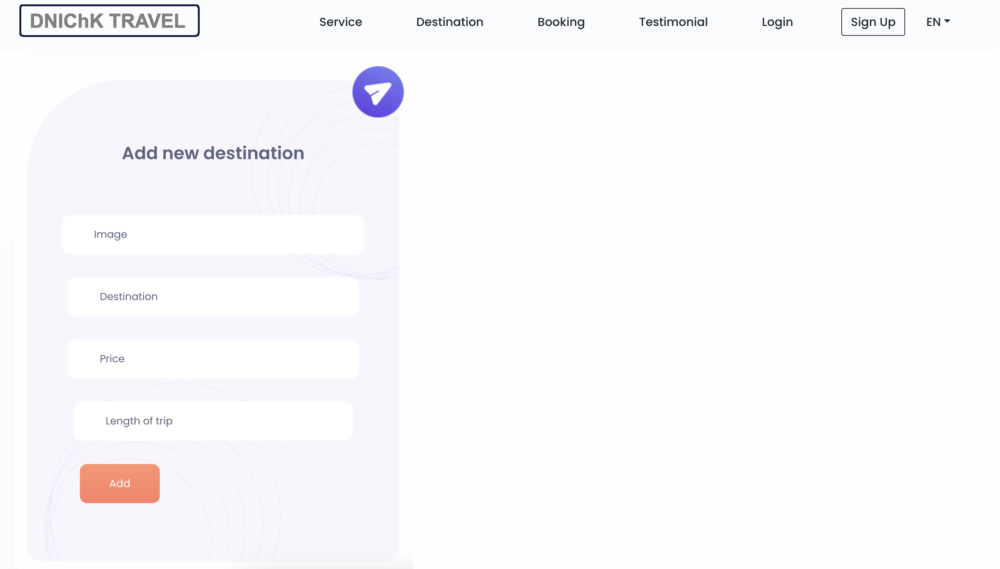

Имате задача да креирате систем за управување со патувања. Системот на првата страна треба да ги листа сите тековни патувања (види index.html). Секое патување има место на патување, цена, времетраење и слика. Системот има и корисници (туристички водачи) кои можат да додаат патувања. Секој од овие корисници има име, презиме, телефон за контакт, и email адреса. Точно се знае кој туристички водич го има додадено кое патување. Само туристичкиот водич може да додавата патување и само тој може да прави промени на патувањата кои ги има додадено. За да може подобро да ја испрезентирате апликација треба да имате додадено барем два туристички водичи и патувањата кои се дефинирани на страната index. 

Исто така потребно е и одредено прилагодување во административниот панел на Django.

Притоа, во рамки на aдмин панелот потребно е да ги обезбедите следните функционалности

- Туристички водичи можат да бидат додени, менувани и бришени само од супер-корисници
- Еден туристички водич може да има максимум 5 дестинации во дадено време
- Кога се брише турситичкиот водач, неговите дестинации по случаен избор се додаваат на остатите туристички водачи
- Вкупната цена на дестинациите на еден туристички водач не смее да надминува 50 000.
- Дестинациите можат да бидат менувани само од туристичките водачи кои се задолжени за таа дестинација, а останатите туристички водачи може само да ги гледаат тие дестинации
- Туристички водач не може да додаде дестинација, ако веќе постои дестинација со тоа име
- На супер-корисниците во Админ панелот им се прикажуваат само туристичките водачи со помалку од 3 дестинации

- Web апликацијата се состои од една почетна страна, прикажана на сликата подолу која ги прикажува сите дестинации и страна за додавање на нова дестинација.

Web апликацијата мора да се стартува за да може да биде прегледана.

index.html

add.html

Другите слики се достапни во media -> images